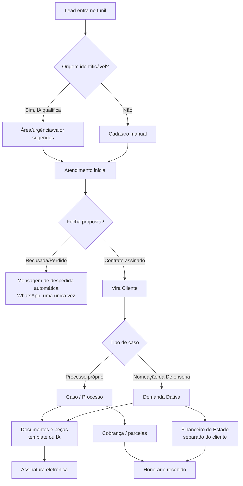
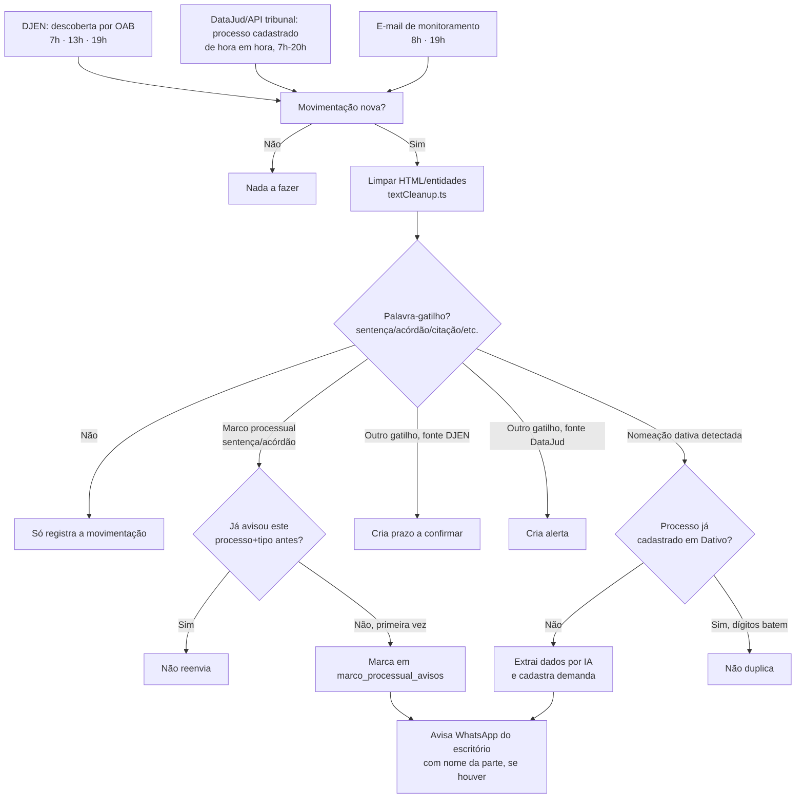

# 00b · Fluxograma do sistema

**Área:** Visão geral · **Autor:** Claude (levantado do código-fonte) · **Última atualização:** 04/09/2026 · **Versão:** 1.0 · **Status:** publicado · **Responsável:** Dra. Letícia Barros (dono do produto) · **Revisão:** atualizar sempre que um fluxo principal mudar de comportamento

## TL;DR

Dois fluxogramas: a jornada de negócio (de lead até honorário recebido) e o fluxo de automação por trás do monitoramento de processo. Renderiza direto no GitHub (e na versão web da documentação).

## Contexto

Consulte quando quiser ver o caminho completo de um caso de uma vez, em vez de módulo por módulo — ou pra explicar o sistema pra alguém novo.

## Jornada de negócio

## Automação de monitoramento de processo

## FAQ

**Por que dois fluxogramas em vez de um só?** A jornada de negócio (o que você vê nas telas) e a automação por trás dela (o que roda sozinho) são coisas diferentes — misturar os dois num diagrama só ficaria ilegível.

**Esses diagramas substituem os blocos de módulo?** Não — são um mapa de alto nível. O detalhe de cada etapa está no bloco correspondente ([Leads](02-leads.md), [Processos](04-processos.md), [Dativo](05-dativo.md), etc.).

## Links relacionados
- [Leads e comercial](02-leads.md)
- [Processos e prazos](04-processos.md)
- [Monitoramento automático](10-monitoramento.md)
- [Dativo](05-dativo.md)

## Changelog

| Data | Autor | Mudança |
|---|---|---|
| 04/09/2026 | Claude | Criação do documento |

---
◀ [Visão geral](00-visao-geral.md) · Próximo: [Clientes e cadastro](01-clientes.md) ▶
